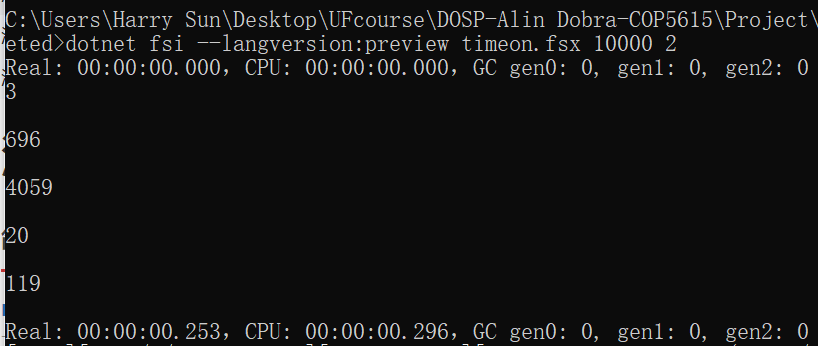

# DOSP Project 1

Group Member
=

Yu, Mingjun(UFID:61707843) 
Sun, Hui(UFID:66542614) 

Introduction
=

The goal of the project 1 is to use ___F#___ and ___Akka Actor Model___ to build a good solution for the _Lucas Square Pyramid_ problem to find __Perfect Square__ on mutiple core. 

Problem Definition
=
An interesting problem in arithmetic with deep implications to elliptic curve theory is the problem of finding perfect squares that are sums of consecutive squares. A classic example is the Pythagorean identity: 

32+42=52
 
that reveals that the sum of squares of 3,4 is itself a square. Amore interesting example is Lucas' Square Pyramid: 

12+22+...+242=702
 
In both of these examples, sums of squares of consecutive integers form the square of another integer. 
The goal of this first project is to use F# and the actor model to build a good solution to this problem that runs well on multi-core machines. 

Requirements
=

__Input:__ The input provided (as command line to your program, e.g. my app) will be two numbers: N and k. The overall goal of your program is to find all k consecutive numbers starting at 1 and up to N, such that the sum of squares is itself a perfect square (square of an integer). 
__Output:__ Print, on independent lines, the first number in the sequence for each solution. 
Example 1: 
dotnet fsi proje1.fsx 3 2 
3 
indicates that sequences of length 2 with start point between 1 and 3 contain 3,4 as a solution since 32+42=52 
Example 2: 
dotnet fsi proj1.fsx 40 24 
1 
indicates that sequences of length 24 with start point between 1 and 40 contain 1,2,...,24 as a solution since 12+22+...+242=702 

Results
=

__How to Run Our Code__ 

You could use command window, then cd to the file and then input <code>"dotnet fsi --langversion:preview timeon.fsx 1000000 2"  to get the answer.
Both of the methods could run our code succeed.

__Size of Work Unit__ 
 
As picture above, if the size of work unit is 1000, there are almost no parallel operation, because the _cputime/realtime_ is approximate 1. 
However, if the size of work unit is 1, there are almost 6 cores. 
 
As picture above, if the size of work unit is 1, there are almost 6 cores, because the _cputime/realtime_ is approximate 6. 

__Result of 1000000 4__ 
 
As picture above, the real time is 01.044, the cpu time is 0.6.296, the gen0 is 38, the gen1 is 2. There is no answer in this picture, because there are no 4 consecutiv numbers whose sum of squares is a perfectsquare. 
 
As picture above, if I input 100000 2, the answer would show in this picture. 

__Result of Time__ 
 
As picture above, I run 500 worker actor, and the cputime/realtime is approximate 8 which means 8 cores. 

__The Largest Problem__ 
 
As picture above, I have already run 100000000 4.

__Aditional Reamarks__ 
 
It can be approved from the paper I read that 4,11 and many other number does not have perfect square, 2 do have perfect squares, and the answer is above.

